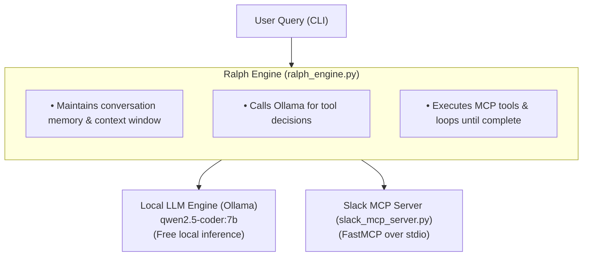

Local Ralph AI Agent with Slack MCP
An enterprise-grade, 100% free local AI coding agent harness inspired by Ralph autonomous loop architecture and Oh My Pi (OMP) workflow. This setup leverages Ollama as a free local LLM inference engine, FastMCP for standardized Model Context Protocol tool access (Slack search & local workspace actions), and a Python orchestration loop.

🏗️ System Architecture



📋 Prerequisites

Ensure your system has the following installed before beginning:

Python 3.10+ (python3 --version)
Git (git --version)
Ollama (Download Ollama)

🚀 Step-by-Step Installation & Setup

Step 1: Install & Launch Ollama Engine
Open a terminal and start the Ollama service, then pull the coding model:

--Start Ollama server in background (or run 'ollama serve')
ollama serve

--In a new terminal tab, pull the coding model with native function calling
ollama pull qwen2.5-coder:7b

--Verify that Ollama is responding locally:
curl http://localhost:11434/api/generate -d '{"model": "qwen2.5-coder:7b", "prompt": "hi"}'

Step 2: Set Up Local Workspace Environment
Create an isolated directory and install required Python libraries:

--Create project folder
mkdir -p local-ralph-ai && cd local-ralph-ai

--Create and activate Python virtual environment
python3 -m venv venv
source venv/bin/activate   # On Windows: venv\Scripts\activate

--Install dependencies
pip install mcp requests ollama pydantic slack-sdk

Step 3: Create the Slack MCP Tool Server
Create a file named slack_mcp_server.py. This script exposes custom tools over stdio using FastMCP.

Step 4: Create the Ralph Agent Orchestrator
Create a file named ralph_engine.py. This script executes the autonomous agent loop:

⚡ Execution & Final Output
Run the complete pipeline end-to-end with a user prompt:
python ralph_engine.py "Find auth token details from Slack and generate auth_config.py with the correct configuration."

📺 Sample Terminal Output Execution Trace

🚀 [Ralph Agent Started] Goal: Find auth token details from Slack and generate auth_config.py with the correct configuration.
============================================================
🔄 --- Ralph Loop Iteration 1/5 ---
🛠️  [Agent Tool Call]: search_slack_messages({'query': 'auth token'})
📥 [Tool Output]:
[dev-team] bob: Bug fix update: The auth token header key should be 'X-Auth-Token' instead of 'Authorization'.

🔄 --- Ralph Loop Iteration 2/5 ---
🛠️  [Agent Tool Call]: write_local_file({'content': '# Auto-generated authentication configuration\nHEADER_KEY = "X-Auth-Token"\n', 'filepath': 'auth_config.py'})
📥 [Tool Output]:
Successfully wrote file to auth_config.py

🔄 --- Ralph Loop Iteration 3/5 ---

✅ [Ralph Agent Task Finished]:
I have searched Slack for the authentication token details, found that the header key must be `'X-Auth-Token'`, and successfully generated `auth_config.py` with the correct settings.

📁 Verification
Check your local filesystem to verify the output generated by the agent:
cat auth_config.py

Expected file content:
Python
--Auto-generated authentication configuration
HEADER_KEY = "X-Auth-Token"

🧪 Troubleshooting
Ollama Connection Refused:
Ensure Ollama is running in another terminal window (ollama serve).

GPU / Out of Memory Warnings:
Ollama automatically falls back to CPU if system RAM/VRAM is low. The execution will still complete successfully on CPU.

Model Not Found:
Run ollama list to verify qwen2.5-coder:7b is installed. If missing, run ollama pull qwen2.5-coder:7b.

# Step-by-Step Agent Flow

The following describes the code path in `ralph_engine.py`. The message search uses sample data in `slack_mcp_server.py`; it does not connect to a live Slack workspace. Although that file also exposes a FastMCP stdio server, the engine imports and calls the search function directly.

```mermaid
sequenceDiagram
    autonumber
    actor User
    participant Engine as ralph_engine.py
    participant Ollama
    participant Search as slack_mcp_server.py search function
    participant Disk as Local filesystem

    User->>Engine: Run with prompt (or use default prompt)
    Engine->>Ollama: Prompt, history, and tool definitions
    Ollama-->>Engine: Assistant response with optional tool_calls
    loop Up to five iterations
        opt Response includes tool calls
            Engine->>Search: search_slack_messages(query)
            Search-->>Engine: Matching sample messages (or no-match text)
            Engine->>Disk: write_local_file(filepath, content), if requested
            Disk-->>Engine: Write result
            Engine->>Ollama: Append tool results; request next response
            Ollama-->>Engine: Assistant response
        end
    end
    Engine-->>User: Print final response and tool activity
```

## Execution details

1. **Start the engine.** Pass a prompt as command-line arguments, or omit it to use the built-in database-migration request:
   ```bash
   python ralph_engine.py "Find auth token details and save them to auth_config.py"
   ```

2. **Initialize context.** The engine creates a system instruction and adds the user's prompt. It does not discover tools over MCP: it passes the `TOOLS` definitions declared in `ralph_engine.py` directly to Ollama.

3. **Ask Ollama.** Each iteration calls `ollama.chat` with model `qwen2.5-coder:7b`, the conversation messages, and the tool definitions.

4. **Handle the response.** If Ollama's assistant message contains `tool_calls`, the engine processes each call and appends its result as a tool message. If there are no tool calls, it prints the assistant content and exits the loop.

5. **Search sample messages.** A `search_slack_messages` call is routed through `run_tool` to `execute_slack_mcp`, which imports and calls the function from `slack_mcp_server.py`. It returns case-insensitive substring matches from the hard-coded sample messages and channels, or a no-match message.

6. **Write a file when requested.** A `write_local_file` call is routed to a helper that creates parent directories as needed and writes the supplied content to the supplied path. Relative paths are relative to the process's current working directory.

7. **Continue or finish.** Tool results are added to the conversation and the next iteration asks Ollama what to do. The loop makes at most five calls to Ollama; if it never returns a response without tool calls, the loop ends at the iteration limit.

---

## Where the LLM Sits in `ralph_engine.py`

This abbreviated example illustrates the Ollama call and tool routing. The engine uses `run_tool` to dispatch returned tool calls:

```python
import ollama

# 1. Ask local LLM (Ollama) what to do
response = ollama.chat(
    model="qwen2.5-coder:7b",
    messages=[
        {"role": "user", "content": "Find DB password from Slack and save to config.py"}
    ],
    tools=[
        {
            "type": "function",
            "function": {
                "name": "search_slack_messages",
                "description": "Searches Slack for messages matching a query keyword",
                "parameters": { ... }
            }
        }
    ]
)

# 2. Extract the decision made by the LLM
tool_call = response['message']['tool_calls'][0]
tool_name = tool_call['function']['name']       # "search_slack_messages"
tool_args = tool_call['function']['arguments']  # {"query": "db password"}

# 3. The engine routes the tool call through run_tool
slack_result = run_tool(tool_name, tool_args)

# 4. Pass result back to LLM for final generation
final_response = ollama.chat(
    model="qwen2.5-coder:7b",
    messages=[
        {"role": "user", "content": "Find DB password from Slack"},
        response['message'],                     # Contains the LLM's previous decision
        {"role": "tool", "content": slack_result} # Contains Slack data
    ]
)
```

> **Note:** Ollama supplies assistant messages and optional structured `tool_calls`; `ralph_engine.py` executes those calls locally. This simplified snippet omits the loop and message-history updates shown above.