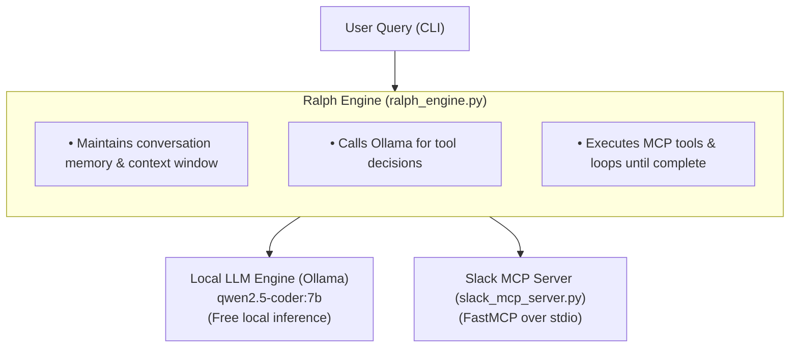
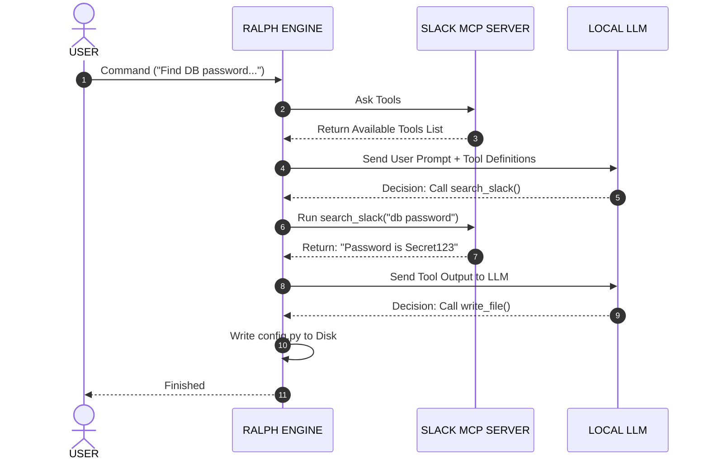

Local Ralph AI Agent with Slack MCP
An enterprise-grade, 100% free local AI coding agent harness inspired by Ralph autonomous loop architecture and Oh My Pi (OMP) workflow. This setup leverages Ollama as a free local LLM inference engine, FastMCP for standardized Model Context Protocol tool access (Slack search & local workspace actions), and a Python orchestration loop.

🏗️ System Architecture

📋 Prerequisites

Ensure your system has the following installed before beginning:

Python 3.10+ (python3 --version)
Git (git --version)
Ollama (Download Ollama)

🚀 Step-by-Step Installation & Setup

Step 1: Install & Launch Ollama Engine
Open a terminal and start the Ollama service, then pull the coding model:

--Start Ollama server in background (or run 'ollama serve')
ollama serve

--In a new terminal tab, pull the coding model with native function calling
ollama pull qwen2.5-coder:7b

--Verify that Ollama is responding locally:
curl http://localhost:11434/api/generate -d '{"model": "qwen2.5-coder:7b", "prompt": "hi"}'

Step 2: Set Up Local Workspace Environment
Create an isolated directory and install required Python libraries:

--Create project folder
mkdir -p local-ralph-ai && cd local-ralph-ai

--Create and activate Python virtual environment
python3 -m venv venv
source venv/bin/activate   # On Windows: venv\Scripts\activate

--Install dependencies
pip install mcp requests ollama pydantic slack-sdk

Step 3: Create the Slack MCP Tool Server
Create a file named slack_mcp_server.py. This script exposes custom tools over stdio using FastMCP.

Step 4: Create the Ralph Agent Orchestrator
Create a file named ralph_engine.py. This script executes the autonomous agent loop:

⚡ Execution & Final Output
Run the complete pipeline end-to-end with a user prompt:
python ralph_engine.py "Find auth token details from Slack and generate auth_config.py with the correct configuration."

📺 Sample Terminal Output Execution Trace

🚀 [Ralph Agent Started] Goal: Find auth token details from Slack and generate auth_config.py with the correct configuration.
============================================================
🔄 --- Ralph Loop Iteration 1/5 ---
🛠️  [Agent Tool Call]: search_slack_messages({'query': 'auth token'})
📥 [Tool Output]:
[dev-team] bob: Bug fix update: The auth token header key should be 'X-Auth-Token' instead of 'Authorization'.

🔄 --- Ralph Loop Iteration 2/5 ---
🛠️  [Agent Tool Call]: write_local_file({'content': '# Auto-generated authentication configuration\nHEADER_KEY = "X-Auth-Token"\n', 'filepath': 'auth_config.py'})
📥 [Tool Output]:
Successfully wrote file to auth_config.py

🔄 --- Ralph Loop Iteration 3/5 ---

✅ [Ralph Agent Task Finished]:
I have searched Slack for the authentication token details, found that the header key must be `'X-Auth-Token'`, and successfully generated `auth_config.py` with the correct settings.

📁 Verification
Check your local filesystem to verify the output generated by the agent:
cat auth_config.py

Expected file content:
Python
--Auto-generated authentication configuration
HEADER_KEY = "X-Auth-Token"

🧪 Troubleshooting
Ollama Connection Refused:
Ensure Ollama is running in another terminal window (ollama serve).

GPU / Out of Memory Warnings:
Ollama automatically falls back to CPU if system RAM/VRAM is low. The execution will still complete successfully on CPU.

Model Not Found:
Run ollama list to verify qwen2.5-coder:7b is installed. If missing, run ollama pull qwen2.5-coder:7b.

# End-to-End Call Flow Sequence
Here is the exact step-by-step path for a command like:
"Find the database password from Slack and save it to config.py."

Step-by-Step Breakdown
User Prompt: You run python ralph_engine.py "Find the DB password in Slack and write to config.py".

Tool Discovery: ralph_engine.py connects to slack_mcp_server.py via standard input/output (stdio) and asks: "What functions do you have?"

Tool Registration: slack_mcp_server.py responds: "I have a tool called search_slack_messages(query)."

Prompting the LLM: ralph_engine.py calls the local Ollama API, sending:

The User Request: "Find DB password..."

The Available Tools list: [search_slack_messages, write_local_file]

LLM Reasoning & Tool Call Decision: The local LLM processes the text and decides it needs external data. It responds to Ralph with a structured JSON request:

JSON
{
  "tool_to_call": "search_slack_messages",
  "arguments": { "query": "db password" }
}
Executing the Slack Tool: ralph_engine.py receives the JSON from the LLM and runs the search_slack_messages("db password") function inside slack_mcp_server.py.

Slack Tool Response: slack_mcp_server.py searches Slack and returns text back to Ralph: "[dev-team] alice: The DB password is Secret123".

Updating LLM Context: ralph_engine.py sends the search result back to Ollama: "The tool returned: 'The DB password is Secret123'. What should I do next?"

LLM Next Action Decision: The LLM reads the result, sees that it found the password, and issues a second tool call:

JSON
{
  "tool_to_call": "write_local_file",
  "arguments": { "filepath": "config.py", "content": "DB_PASSWORD=Secret123" }
}
File Creation & Completion: ralph_engine.py executes write_local_file, writes config.py to your local hard drive, and displays the final completion message to you.

Where the LLM Sits in ralph_engine.py
This simplified Python snippet demonstrates where the LLM call happens inside ralph_engine.py:

Python
import ollama

1. Ask local LLM (Ollama) what to do
response = ollama.chat(
    model="qwen2.5-coder:7b",
    messages=[
        {"role": "user", "content": "Find DB password from Slack and save to config.py"}
    ],
    tools=[
        {
            "type": "function",
            "function": {
                "name": "search_slack_messages",
                "description": "Searches Slack for messages matching a query keyword",
                "parameters": { ... }
            }
        }
    ]
)

2. Extract the decision made by the LLM
tool_call = response['message']['tool_calls'][0]
tool_name = tool_call['function']['name']       # "search_slack_messages"
tool_args = tool_call['function']['arguments']  # {"query": "db password"}

3. Ralph executes the requested tool via slack_mcp_server.py
slack_result = execute_mcp_tool(tool_name, tool_args)

4. Pass result back to LLM for final generation
final_response = ollama.chat(
    model="qwen2.5-coder:7b",
    messages=[
        {"role": "user", "content": "Find DB password from Slack"},
        response['message'], # Contains the LLM's previous decision
        {"role": "tool", "content": slack_result} # Contains Slack data
    ]
)
The LLM does not perform actions itself; it acts as a decision engine that reads inputs and outputs structured JSON instructing ralph_engine.py on which local script or MCP server to run next.